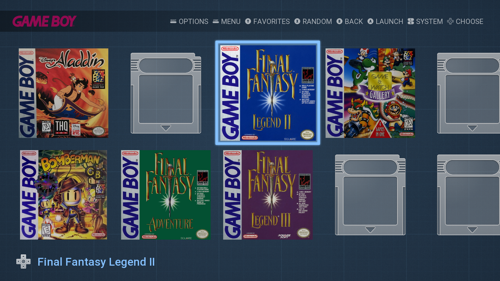

# RetroGridTheme

|  |
|:--:|
|  Preview |

  
**Custom theme for Emulationstation**

- This porject is just a hobby (aka low priority) 
- Theme is designed for the **Grid** view
- May not scale properly at non-1080p resolutions
- If theme is not working make sure you are running the latest build of Emulationstation. 
- Tested using RetroPie

# Goals

- [ ] Prefect **Grid** view for most systems
- [ ] Start **Details** view 
- [ ] Star **Video** view (match details view?)
- [ ] Make icons for all systems
- [ ] Theme colors match each system (like how SNES has purple)
- [x] Remake some assets to match the style of the rom images
